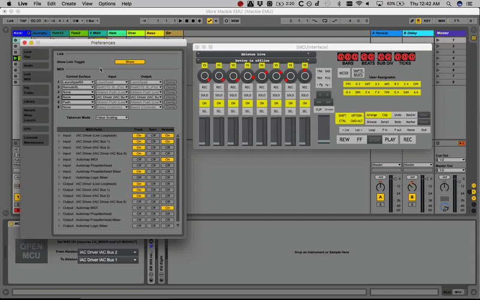

# Mackie HUI for Max/MSP and Max4Live 
 A full implementation of the Mackie control protocol using Max/MSP 
 Developed by Eric Bateman 
 
 
 
 Requirements for Max4Live:
 * lh_midiin and lh_midiout by Leigh Hunt
 * Live 9 32bit (lh_midiout doesn't support 64 bit)
 * Max for Live 7
 
 
